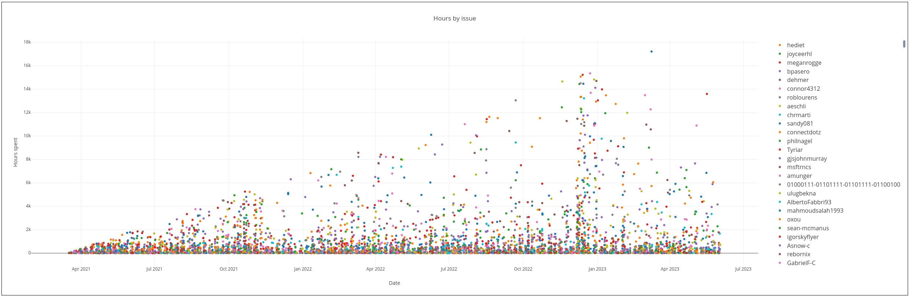
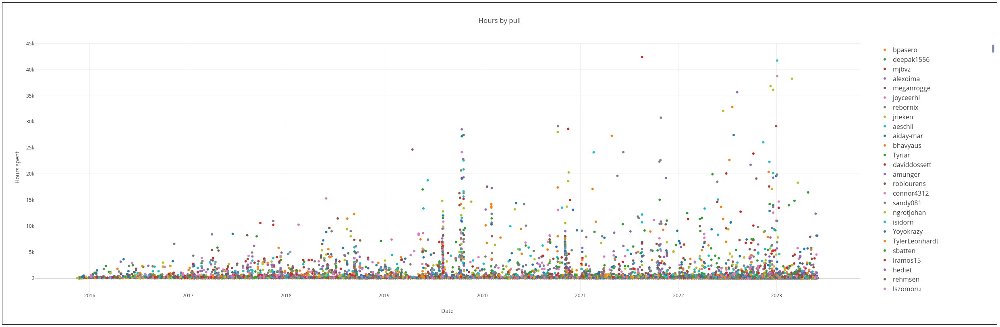
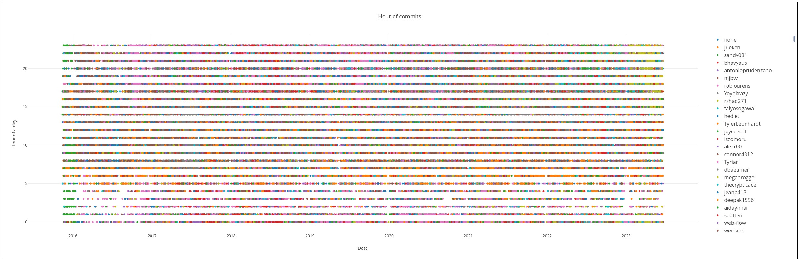

# Моделирование процессов

## Что это?

 * репозиторий для моделирования процессов разработки ПО
 * Проект инструмента моделирования
 * Разбор книг, текстов, докладов про моделирование
 * реальные данные для анализа задач/кода
 * скрипты парсера данных

## Что тут есть?

 * [тут](./utils/) портативный рисователь нейросхем [freeplane](https://www.freeplane.org/), потомок почившего freemind, версия 1.11.1
 	* рисователь мнемосхем пропатчен, увеличена память для экспорта картинок `JAVA_OPTS="-Xmx1000g $JAVA_OPTS"`
 * [тут](./assets/vscode.github/github.api.http) скрипты для плагина vscode [humao.rest-client](https://marketplace.visualstudio.com/items?itemName=humao.rest-client)
 * [тут](./doc/README.md) подробная документация и аналитика
 * [тут](./tokens/) bash скрипты с ENV VARIABLES и токенами для cloud api
 * [тут](./doc/нейросхемы/) нейросхемы, сырые данные(архивы, csv, таблицы excel)
 * [тут](./src/parser/json-parse.github.ts) исходники парсера
 * [тут](./log) промежуточные данные: JSON, CSV файлы парсера и скриптов загрузки из cloud API
 * [тут](./log/csv) выходные данные CSV парсера
 * [тут](./src/graph/data/) выходные JSON данные парсера для web UI

## Для кого?

 * тимлидов, разработчиков, аналитиков, любителей разобраться в качестве процессов/проектов

## Как пользоваться?

 * нейросхемы смотреть через freeplane, он кроссплатформенный на java
 * md смотреть любым текстовым редактором или через IDE
 * [CHANGELOG](https://t.me/stepanovv_ru_kb)

### настройка проекта

* клонируем репу
	```bash
		git clone https://github.com/bskydive/process_modeling.git
		cd process_modeling
	```
* ставим [node version manager](https://github.com/nvm-sh/nvm) либо nodejs вручную
* ставим пакеты  
	```bash
		nvm i 20
		npm i
	```
### исходные данные

 * данные vscode github repo
	* надежда на любовь M$ к github питает вероятность качественных данных
    * [закрытые задачки, которые ушли в релиз](https://github.com/microsoft/vscode/issues?q=is:issue+is:closed+reason:completed+label:insiders-released)
    * [закрытые PR](https://github.com/microsoft/vscode/pulls?q=is:pr+is:merged&page=1)
 * отладка API запросов к репе
    * ставим плагин vscode [humao.rest-client](https://marketplace.visualstudio.com/items?itemName=humao.rest-client)
	* [делаем токен тут](https://github.com/settings/tokens?type=beta)
    * запихиваем токен в vscode settings.json
        ```bash
            "rest-client.environmentVariables": {
                "$shared": {
                    "gh-api-token": "SOMETOKEN"
                }
            }
        ```
    * [запихиваем токен в ENV VAR](./tokens/.gh-api-token.sh)

        ```bash
            #!/bin/bash
            export gh_api_token="SOMETOKEN"
        ```
	* запускаем [API запросы](./assets/vscode.github/github.api.http) вручную, смотрим ответ и заголовки ответа
 * загрузка данных с нуля
	* [сделать токен](https://docs.github.com/ru/rest/guides/getting-started-with-the-rest-api) для REST API github
	* вписать токен в [скрипт](./tokens/.gh-api-token.sh.empty)
	* понеслась
	```bash
		mv ./tokens/.gh-api-token.sh.empty ./tokens/.gh-api-token.sh	#переименовать скрипт
		bash ./src/scripts/download-issues.vscode.api.github.sh			# загрузить данные ISSUES
		bash ./src/scripts/download-pulls.vscode.api.github.sh			# загрузить данные PULLS
		bash ./src/scripts/download-commits.vscode.api.github.sh		# загрузить данные COMMITS
		bash ./src/scripts/validation.vscode.api.github.sh				# проверить количество данных
	```
 * подготовка данных без загрузки
	```bash
		tar -xf ./assets/vscode.github/pulls.responses.tar.gz -C ./log/
		tar -xf ./assets/vscode.github/issues.responses.tar.gz -C ./log/
		tar -xf ./assets/vscode.github/commits.responses.tar.gz -C ./log/
	```

### обработка данных

 * подготавливаем данные - см. варианты выше
 * запуск парсера 
	```bash
		npm run parse

		# вывод парсера
		# parsed issues:  7110 parsed pulls:  21183 parsed commits:  110168
		# write:  ./log/csv/curl-vscode-ISSUES-2023-06-21T15:48:30.224Z-PARSED.csv 955429
		# write:  ./log/csv/curl-vscode-PULLS-2023-06-21T15:48:30.224Z-PARSED.csv 3654447
		# write:  ./log/csv/curl-vscode-COMMITS-2023-06-21T15:48:30.224Z-PARSED.csv 23634225
		# write:  ./src/graph/data/issues-closed.vscode.json 7110
		# write:  ./src/graph/data/pulls-closed.vscode.json 21183
		# write:  ./src/graph/data/commits.vscode.json 110168
	```
 * смотрим в файлы - см. пути выше
 * запуск UI
	```bash
		npm run start
	```
 * открываем в браузере `http://127.0.0.1:8080`
 * 
 * 
 * 

## дополнительные инструменты

 * [анализ git на bash+awk](https://github.com/arzzen/git-quick-stats/tree/master)
 * [поиграться с графиками](https://chart-studio.plotly.com/create/)

## лучи добра великим предкам

 * https://github.com/greenrd/genmailmap/blob/master/genmailmap.sh
 * https://github.com/dreamyguy/gitlogg/blob/master/scripts/gitlogg-generate-log.sh

## TODO

 * [см](./doc/README.md#графики)
	* график ротации команд
	* график отпусков
 * сделать парсер и визуализатор данных о процессах
	* проверить работу отладчика nodejs
	* проверить развёртывание с нуля
	* запилить кучу графиков
	* JSON.parse: remove unusual line terminators
	* фильтрация данных
	* [красота](https://www.npmjs.com/package/angular-plotly.js)
 * сделать движок моделирования
	* модель модели данных
	* конфигуратор алгоритма модели
		* графы
		* парсер yEd
	* машина состояний
	* логирование
	* отладка состояний
	* парсер выходных данных
 * подключить движок моделирования к визуализатору
	* парсер входных данных
 * сделать режим обратного проектирования
	* угадываем параметры модели по выходным данным
 * добавить ещё больше парсеров входных данных
	* JIRA
	* gitlab
	* bitbucket
	* git
	* bash
	* eslint

## Как связаться с автором?

 * https://t.me/stepanovv_ru
