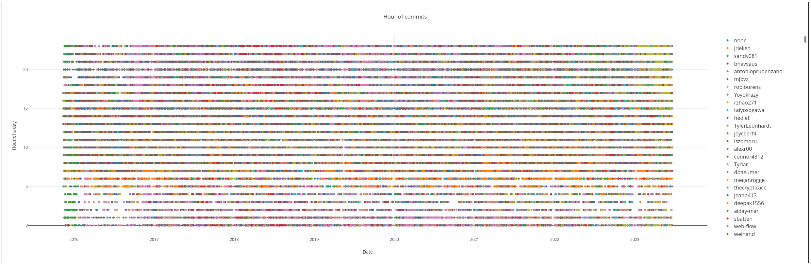
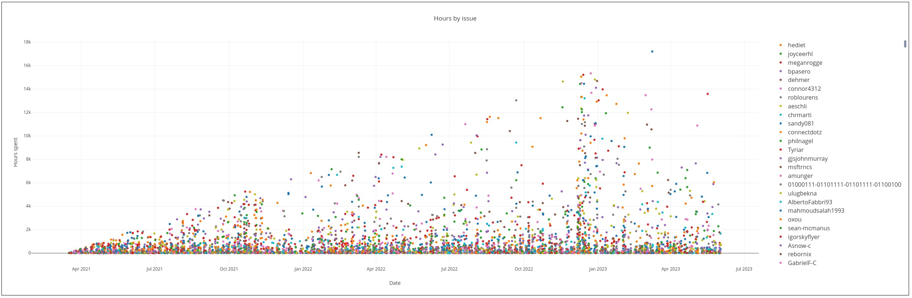

# Документация и аналитика

## Проектирование

 * [нейросхема](./%D0%BD%D0%B5%D0%B9%D1%80%D0%BE%D1%81%D1%85%D0%B5%D0%BC%D1%8B/process_modeling.mm)
 * 
 * 
 * [сценарии](./%D1%81%D1%86%D0%B5%D0%BD%D0%B0%D1%80%D0%B8%D0%B8.md)
 * [excel таблицы Дорофеева](./%D1%82%D0%B0%D0%B1%D0%BB%D0%B8%D1%86%D1%8B/%D0%A7%D0%B0%D1%81%D1%82%D1%8C%203.%20%D0%94%D0%BE%D0%B1%D0%B0%D0%B2%D0%BB%D1%8F%D0%B5%D0%BC%20%D1%81%D1%82%D0%B0%D1%82%D0%B8%D1%81%D1%82%D0%B8%D1%87%D0%B5%D1%81%D0%BA%D0%BE%D0%B5%20%D0%BA%D0%BE%D0%BB%D0%B4%D1%83%D0%BD%D1%81%D1%82%D0%B2%D0%BE.xlsx)
 * [оценка задач](./%D0%BE%D1%86%D0%B5%D0%BD%D0%BA%D0%B0%20%D0%B7%D0%B0%D0%B4%D0%B0%D1%87.md)
 * [разбор видео про техдолг](./%D1%82%D0%B5%D1%85%D0%B4%D0%BE%D0%BB%D0%B3.md)

### Параметры анализа

 * ответы на главные вопросы: ожидания команды и бизнеса, что происходило с командой, кодом, процессами
 * прогнозы: сложность, скорость, производительность, объём кодовой базы
 * потери времени между этапами: issue, PR
 * добавление времени закрытия(без пересечений по датам): issues+pulls
 * суррогат времени закрытия: замена issues на pulls, время закрытия на количество строк/файлов
 * переоткрытие issue: ссылки на старые issue
 * производительность труда(ожидания бизнеса, тест бильярдного шара): issue/lines, commit/lines, workday/lines, churn
 * issues
	* id
	* дата создания
	* дата закрытия
	* создатель
	* исполнитель
 * PR
	* исполнитель
	* дата создания
	* дата закрытия
	* commit id
 * git commit
	* дата создания
	* количество строк +
	* количество строк -
	* количество файлов
	* папки
	* файлы

### Графики
 
 * готово
	* 
	* 
	* 

 * график длительности задач
	* дата закрытия
	* автор
	* часов на выполнение
 * график роста кодовой базы:
    * строк добавлено
	* строк удалено
    * дата
    * автор
	* название ветки
 * график работы(рабочие часы, возможность 40-часовой рабочей недели)
    * количество коммитов
    * дата
	* время
	* день недели
    * автор коммита
 * график ротации команд
    * количество активных авторов коммитов за период
		* парсиинг всех авторов в массив через git
		* массивы коммитов авторов, дата коммита
		* дата первого и крайнего коммита для каждого автора
		* заполнение графика от первой до крайней даты
    * дата/период
 * график отпусков
    * количество неактивных авторов коммитов за период
		* парсиинг всех авторов в массив через git
		* массивы коммитов авторов, дата коммита
		* массивы перерывов между коммитами, дата начала, количество дней
		* заполнение графика от первой до крайней даты
    * дата/период
	* признак отсутствия активности, дней
 * график роста связности
    * строк добавлено, строк удалено
    * дата/период
    * путь к модулю(папка)
 * график роста производительности труда
    * количество коммитов/issue за период
    * количество авторов активных более 0,5 года(за период)
    * количество авторов активных менее 0,5 года(за период)
    * дата/период
 * комплексные графики(запуск скриптов на дату окончания периода)
    * качество кода
    * размер кодовой базы
    * связность кода
    * покрытие типами данных
    * покрытие тестами
    * время сборки проекта
 * график выгорания, уровень счастья
    * производительность выше/ниже средней/средневзвешенной

## Графы

 * [сложность проекта](https://github.com/bskydive/webpack-dep-graph)
	* узлы: функции, файлы, папки, домены
	* размер узла: количество строк
	* цвет узла: сложность, количество проблем, количество связей
	* цвет связи: количество import, включая функции/свойства

## Результат анализа

 * аналитика [excel с графиками](../assets/vscode.github/vscode-analysis.github.ods)
	* Автоматизирован полный путь данных от API до GUI
	* 
 * исходные данные в открытом бэклоге
    * 7110 issues которые ушли в релиз
        * `grep '"url": "https://api.github.com/repos/microsoft/vscode/issues/' log/issues.responses/*.json | wc -l`
    * 21183 pulls closed - в 2 раза больше из-за скрытой репы vscode-internalbacklog
        * `grep '"url": "https://api.github.com/repos/microsoft/vscode/pulls/' log/pulls.responses/*.json | wc -l`
		 * [скрытый бэклог](https://github.com/microsoft/vscode-internalbacklog/issues/4174), видно [тут](https://github.com/microsoft/vscode/pull/183564)
 * Данные провалидированы 2 способами: bash+grep и nodejs+JSON.parse, количество issues/pulls сошлось
 * Сырые данные и результаты выложены в архивах в папке `assets`
 * Самые большие затраты времени за весь период(у кого больше всего назначено issues)
	1	Tyriar
	2	roblourens
	3	alexdima
	4	rebornix
	5	mjbvz
	6	sandy081
	7	hediet
	8	jrieken
	9	lszomoru
	10	joaomoreno
 * 

