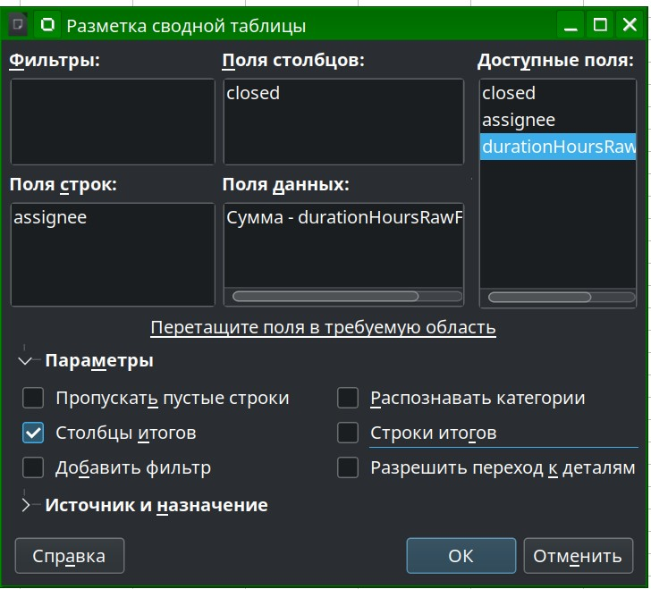
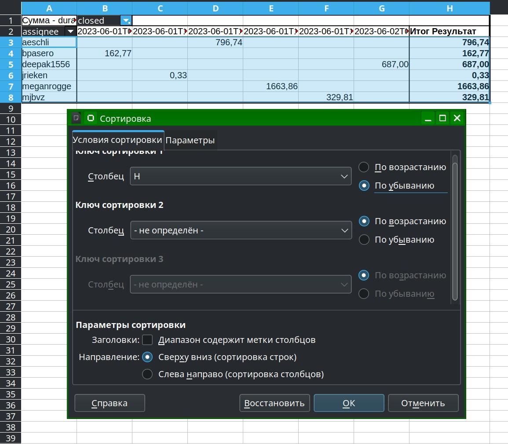

# аналитика проекта

## Ссылки

 * [моделирование и проектирование состояний системы, спецификаций(Alloy](https://habr.com/ru/company/yandex/blog/457810/)
 * [Максим Дорофеев — Эффективность неэффективности Встреча CodeFreeze в Москве, 10.07.2014](https://youtu.be/XDF02KmgJFE?list=PLm6zCN_KJCrX81iojL2lE2gHSbwnQE-QI&t=1560)
 * [Принцип экономии мыслетоплива / Максим Дорофеев (mnogosdelal.ru)](https://www.youtube.com/watch?v=fWR5SFhBUWc)
 * [Измерения в Scrum и Kanban: Шухарт, 6-сигма и люди снежинки с руками из жопы Дорофеев ](https://www.youtube.com/watch?v=VPDJXngp2bM)
 * [Несеребряные пули или кратко про методы софтостроения](https://habr.com/ru/post/546908/): нисходящий, восходящий, спиральный
 * https://toolshed.com/2015/05/the-failure-of-agile.html
 * [группа экспертов про научный подход к процессам - code review долго плохо дорого](https://www.youtube.com/watch?v=IDj3x__YZgE&list=PLFtS8Ah0wZvWS37oveJ0-D5K6V7GWUpqY&index=13)
 * [текстовый квест "симулятор тимлида"](https://habr.com/ru/companies/wrike/articles/679146/)
 * [инструмент для моделирования логики процессов - построил модель, посмотрел результат тысячи прогонов](https://cloud.anylogic.com/models)
 * [Три стадии оптимизации процессов - Перформанс: что в имени тебе моём? — Алексей Шипилёв об оптимизации в крупных проектах](https://habr.com/ru/companies/jugru/articles/338732/)
 * [Design Review и другие друзья разработчика, Дельгядо Филипп](https://www.youtube.com/watch?v=4Y0XJXRZv6k)
 * [Код ревью и парное программирование. Эффективность и гуманность ](https://music.yandex.com/album/13732143/track/112642653?dir=desc&activeTab=track-list)
 * https://www.litres.ru/daniel-kaneman/shum-nesovershenstvo-chelovecheskih-suzhdeniy/

## источники данных

Кандидаты на анализ через git и gitlab/github API. Ищу крупные проекты на typescript со сборщиком webpack, так будет проще собрать статистику.
Поиск осложняется тем, что в наиболее крупных репах используется nx или bazel. К ним необходимо отдельно допиливать или искать утилиты для сбора аналитики.

 * где искать
     * https://gitmostwanted.com/top/stars/?term=&lang=TypeScript
     * https://gitlab.com/explore/projects/starred?name=angular&sort=stars_desc&language=19
 * [vscode](https://github.com/microsoft/vscode/blob/main/package.json)
    * IDE
    * TypeScript 93.9%, webpack 5
 * [nx](https://github.com/nrwl/nx)
    * build system
    * webpack 5, TypeScript 98.3%
 * [soapbox](https://gitlab.com/soapbox-pub/soapbox)
    * соцсеть
    * tsx 52.7%, typescript 44.8%, react 18, webpack 5, 9.7 GB Project Storage
 * [manyverse](https://gitlab.com/staltz/manyverse/-/tree/master)
    * соцсеть
    * tsx 87.8%, react 17, webpack 4, 722.5 MB Project Storage

## Инструменты

 * [git](https://stepanovv.ru/kbo/#/kb/frontend/git?id=%d0%b8%d0%bd%d1%81%d1%82%d1%80%d1%83%d0%bc%d0%b5%d0%bd%d1%82%d1%8b)
 * [webpack](https://github.com/bskydive/webpack-dep-graph)
 * [методика](https://github.com/bskydive/code_quality_js)
 * issues github
    * [токены github api](https://github.com/settings/tokens?type=beta)
    * https://docs.github.com/en/rest/issues/issues
    * https://docs.github.com/en/rest/overview/resources-in-the-rest-api
    * https://github.com/github/rest-api-description/tree/main/descriptions/api.github.com
    * https://docs.github.com/en/rest/issues/issues?apiVersion=2022-11-28#list-repository-issues
    * https://docs.github.com/en/rest/pulls/pulls?apiVersion=2022-11-28#about-pull-requests
 * issues gitlab
    * https://docs.gitlab.com/ee/api/issues.html
    * 
 * postman
    * [скрипты для любителей GUI](https://learning.postman.com/docs/writing-scripts/intro-to-scripts/)
    * 
 * git
	* https://github.com/arzzen/git-quick-stats
	* https://github.com/jwiegley/git-scripts
	* https://github.com/tj/git-extras
	* https://github.com/adamtornhill/code-maat
 * подготовка данных csv
	* меню лист-->вставить лист из файла-->./log/curl-vscode-ISSUES-2023-06-07T15:09:22.994Z-PARSED.csv
	* вырезаем первые три столбца, удаляем первую строку
	* выделяем, делаем сводную таблицу: 
		* заменяем в столбце времени точки на запятые
		* меняем формат столбца времени на числовой, дробный
		* данные: durationHoursRawFloat
		* строки: assignee
		* столбцы: closed
		* столбцы итогов
		* 
	* сортируем по времени
		* выделяем всё кроме первых двух строк
		* меню данные-->сортировка-->выбираем столбец с итогами(суммой)-->по убыванию
		* 
	* делаем график
		* TODO сделать линию, добавить нули вместо пустых ячеек
		* TODO добавить текст
		* 
 * [csv после парсинга](../assets/vscode.github/log.tar.gz)
	* issues, pulls
	* столбцы: 
		* дата закрытия
		* исполнитель
		* приведённое(дробное) время исполнения в часах
		* приведённое(человеко-читаемое) время исполнения(DD-HH-MM-SS)
		* url в облаке для подробностей
		* commit для pulls

## визуализация

 * https://www.coursera.org/courses?query=power%20bi
 * [Что мы узнали о сотрудниках, когда начали использовать аналитику в HR](https://habr.com/ru/companies/redmadrobot/articles/485864/)
 * alphaplot
    * аналог veusz без документации
 * [veusz]()
    * удалось построить график
    * нет возможности менять тип данных вручную, он выбирается автоматически
    * дробные числа только с запятой
    * есть документация
    * есть функции/код
    * не удалось найти как делать составные графики без хардкода
 * yEd
 * plotly
	* потребовался webpack
	* есть риски платности